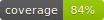

# GBM Inverse Potential Reconstruction

[](https://github.com/M-Gage-Plott42/GBM_Inverse_Potential_Recon/actions/workflows/ci.yml)
[](https://github.com/M-Gage-Plott42/GBM_Inverse_Potential_Recon/actions/workflows/codeql.yml)
[](https://github.com/M-Gage-Plott42/GBM_Inverse_Potential_Recon/actions/workflows/docs.yml)
[](docs/coverage.md)
[](https://github.com/M-Gage-Plott42/GBM_Inverse_Potential_Recon/releases)
[](pyproject.toml)
[](LICENSE)
[](https://doi.org/10.5281/zenodo.20693817)

A small public research-code artifact for inverse radial density and potential
reconstruction from sparse spectral-moment information.

This repository is the first public slice of a broader Generalized Borel Method
(GBM) research line. It is not a publication of the private research workspace
and does not contain the full private GBM stack. Public v0 starts with a narrow,
deterministic Fourier/form-factor route for the three-dimensional harmonic
oscillator ground state, so reviewers can inspect and run a clean proof artifact
before any larger research components are considered for release.

## What Is Included

- A minimal Python package under `src/gbm_inverse_potential/`.
- A Fourier/form-factor density reconstruction path using even radial moments.
- A finite-difference potential reconstruction smoke path.
- A deterministic harmonic-oscillator demo and unit tests.
- Public-release guard docs, sanitization checks, citation metadata, and CI.

## Evidence Status

Current public scope:

- installable Python package with `numpy` as the only runtime dependency;
- deterministic CLI and example script for the oscillator smoke case;
- expanded public examples for moment-series and alpha-sweep smoke checks;
- unit tests for moments, form-factor reconstruction, inverse density recovery,
  potential reconstruction, and sanitizer coverage;
- coverage measured in CI with a checked-in coverage badge;
- MkDocs documentation site configuration and GitHub Pages deployment workflow;
- public reproducibility notes in `docs/reproducibility.md`;
- smoke benchmark metrics in `docs/public_smoke_benchmark.md`;
- command-reproducible public demo SVG workflow in
  `scripts/reproduce_public_demo_figure.py`;
- MIT license, `CITATION.cff`, pinned GitHub Actions, Dependabot, and CodeQL.

## What Is Excluded

This first pass intentionally excludes private source-repo history, private
handoff packets, raw run outputs, workstation or cluster configuration, large
media files, manuscript sync notes, archived operational docs, private local
paths, and claims about unpublished/private research beyond the public v0
artifact.

## Quick Start

```bash
python3 -m venv .venv
source .venv/bin/activate
python -m pip install --upgrade pip
python -m pip install -e .
python -m unittest discover -s tests
python examples/harmonic_oscillator_demo.py
python examples/moment_series_comparison.py --json
python examples/alpha_sweep_smoke.py --json
python -m gbm_inverse_potential.cli --json
```

Expected demo behavior: the reconstructed reduced density and reconstructed
potential should have small relative errors on the documented smoke grid.

## CLI

```bash
python -m gbm_inverse_potential.cli --json
```

## Public Demo Figure

The repository does not claim to reproduce private manuscript figures. It
includes a command-reproducible public demo figure for the same oscillator smoke
case:

```bash
python scripts/reproduce_public_demo_figure.py > /tmp/gbm_public_demo_density.svg
```

The SVG overlays the analytic reduced density with the reconstructed reduced
density from the public Fourier/form-factor path.

## Documentation Site

The MkDocs source lives in `docs/` and is configured by `mkdocs.yml`. The
intended GitHub Pages URL is:

https://m-gage-plott42.github.io/GBM_Inverse_Potential_Recon/

The docs workflow builds the site on pull requests and deploys from `main` when
GitHub Pages is configured to use GitHub Actions.

## Repository Status

This is the first public v0 artifact from the sanitized GBM derivative path.
The scope is intentionally narrow: harmonic-oscillator Fourier/form-factor
density and potential reconstruction plus release-safety checks. The private
research workspace and broader GBM stack remain excluded.

For the exact public v0 scope and limitations, see `docs/scope_contract.md`.

Future additions should pass the same allowlist, sanitization, test, and human
review gates before they are folded into this public repository.

## Reproducibility And Benchmark Notes

- Reproducibility notes: `docs/reproducibility.md`.
- Public smoke benchmark: `docs/public_smoke_benchmark.md`.
- Release and safety gate: `docs/publish_gate.md`.
- File manifest enforced by the sanitizer: `docs/release_file_manifest.txt`.

## Maintainer / Help

Maintained by Matthew Gage Plott. Use GitHub Issues for ordinary questions.
For suspected private-data or security exposure, do not open a public issue;
follow `SECURITY.md`.

## License

MIT.

## Citation

Use `CITATION.cff` for the current software citation metadata.

- Version DOI for `v0.2.0`: https://doi.org/10.5281/zenodo.20709098
- Version DOI for `v0.1.1`: https://doi.org/10.5281/zenodo.20693818
- Concept DOI for all versions: https://doi.org/10.5281/zenodo.20693817
